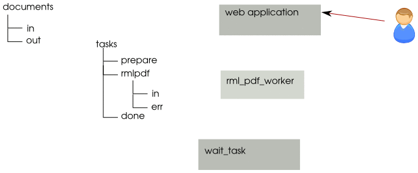

Some use case
==============

Here are some use case to help you grasp how it works.
Those are real production usage.

.. FIXME put links to usage sections

Generating big PDF from RML
-------------------------------

z3c.rml can be resource consuming for big files
(say 150 pages with lots of external pdf inclusions).
Document chain helps generating the pdf out of application.

As the user ask for a report, the rml is generated in a temporary folder
along with symlinks to necessary files.
A task then ask the worker to generate the file and
the user is redirected to the service which will wait for the task to complete.
As the worker finish, the user download the files
and all the stuff is removed from the server.

.. source is rml-pdf-chart.svg,
   on each layer a number indicate on wich image it shall be active

1. user request the application
2. application prepare a rml file, and a task file
3. at commit time, the task is moved to the *right* folder
   and a response is send to the user to redirect him
   to the wait task service
4. inotify signal the new task to the rml2pdf process (aka rml_pdf_worker)
5. while pdf generations append, the user may poll for file existence
   through wait task service, it will return an empty response as task is
   not yet done.
6. finally the pdf file is generated and rml_pdf_worker move the task
   to the next folder.
7. as the user ask again for its file the pdf is retrieve and sent to him.
   After that all file may be removed from the filesystem.

Reindexing out of request
--------------------------

Changing users right on an application
may change indexation for a lot of objects.
Instead of doing re-indexation in the same http request,
the application just create a task file,
asking the http worker to call back a specific url,
which will handle reindex.

If re-indexation fail, the administrator will be able to relaunch the task.

Document transform
--------------------

This case is similar to `Generating big PDF from RML`_.
A variation here will be that instead of giving the file back to the user,
we just feed it back in the application.

#. The web application create a task file
  and dump the file to be transformed on the filesystem.
#. At commit time, the application moves the file to the unoconv worker queue,
   and return its page to the user.
#. The unoconv worker [#]_ convert it thanks to `libre office`_.
   It dumps the file at a place specified in the ticket
   and then move the task to next folder (specified in task)
   which is the HTTP worker queue.
#. The HTTP worker push the file back to the application using parameters
   indicated in the task file.
#. If the HTTP receive a normal response (say 200)
   it moves the task to the next folder (which is a terminal folder)
#. The user may now see the pdf in the application
   (may it be because of a page refresh
   or an ajax script which was polling for pdf existance).

.. [#] we use https://github.com/dagwieers/unoconv
.. _`libre office`: https://www.libreoffice.org/
